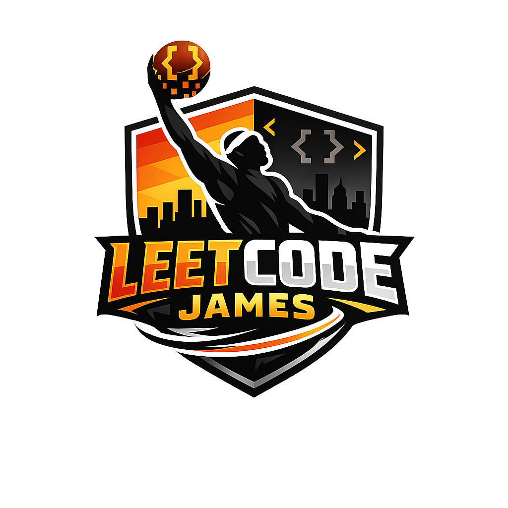

# LeetCode James

> *Something doesn't just pop under your repo; you have to code it.*

---

## Who We Are

LeetCode James is a team of CS students at UC San Diego. Our brand is inspired by LeBron James, with team colors of yellow, purple, and orange.

---

## Values

- Write code that speaks for itself
- Communicate early, communicate often
- Work in pairs or small groups, but keep the whole team in the loop
- Everyone should be reading assignment specifications and catching issues when they can

---

## How We Work

| | |
|---|---|
| **Communication** | Slack |
| **Meetings** | Zoom meetings more often; aiming for in-person Friday mornings (~1 hour) |
| **Workflow** | Try to work in pairs or small groups, but always communicate with the whole team |

---

## Roster

### Brendan Barber
[GitHub](https://github.com/BrendanBarber)

Hello! I'm Brendan, a computer science student with a fascination for graphics programming and creative technologies. I love bridging the gap between artistic vision and technical implementation, whether that's building VFX tools for artists or creating video games. When I'm not coding, you'll find me practicing violin, playing casual ice hockey, or getting lost in a good book.

**Fun fact:** I have been to 40/50 U.S. states.

---

### Nick Doan
[GitHub](https://github.com/nhdoan0412)

Hi, I'm Nick. I am especially interested in front-end development, data engineering, and creating systems that make complex information easier for people to understand. My favorite programming language is Java because I like object-oriented programming.

**Fun fact:** I'm a Barcelona fan.

---

### Timothy Washburn
[GitHub](https://github.com/timothywashburn)

I love to learn, code, play music, and meet other passionate people. Strengths / interests: Playing piano, woodworking, talking endlessly.

**Fun fact:** I love Minecraft.

---

### Crystal Nguyen
[GitHub](https://github.com/crystalngyn645)

Crystal Nguyen - 3rd Year Computer Science Major at UCSD. I am interested in cybersecurity and artificial intelligence, with a focus on building secure and data-driven solutions. I am interested in books and music.

**Fun fact:** I can move my ears, individually or both simultaneously.

---

### Beckham Yeoh
[GitHub](https://github.com/beckhamyeoh)

3rd year CS major. Interested in software engineering and game development. Am comfortable with C++. I love soccer and anime.

**Fun fact:** I am a Manchester United fan.

---

### Sharana Sabesan
[GitHub](https://github.com/sharana-sabesan09)

Sharana Sabesan - 2nd year CS major at UCSD. I am interested in analyzing different data types and modeling data via Python libraries and data visualization tools. Garbage in = garbage out but good data = good output! My strengths are data handling, Python / Java, and building extensions. I'm interested in Reinforcement Learning and agentic AI applications.

**Fun fact:** I've travelled to over 10 countries.

---

### Jonathan Hunter
[GitHub](https://github.com/ItsStressful)

I am a student of computer engineering adept in Python, C, Java, iOS app development, and ARM assembly. I am pursuing a software engineering internship to enhance skills and make meaningful contributions to significant projects, embracing a collaborative ethic. Strengths / interests: Python, C, Java, iOS app development, ARM assembly, and CPU architecture.

**Fun fact:** I was bitten by three black widows when I was really little, and spent a month in the hospital.

---

### Neil Yang
[GitHub](https://github.com/Neiljya)

Hello, I am Neil Yang, a second year CS major at UCSD. I'm interested in a breadth of technologies primarily in cloud & databases. Skills: Python, C, JavaScript, TypeScript, SQL, AWS, GraphQL, React. I enjoy going on side quests and playing the piano sometimes.

**Fun fact:** I almost got lost in the mountains as a kid.

---

### Jeremy Shih
[GitHub](https://github.com/Macu239)

Hi, I am Jeremy, a 3rd year CS student. I am still figuring out my focus field; I am interested in learning basically everything related to CS. Skills: React, JavaScript, HTML/CSS. I mostly appear in the kitchen and gym when I am not studying — I love cooking/bartending, especially Asian food.

**Fun fact:** I used to live in the worst area in Baltimore.

---

### Asaki Billawala
[GitHub](https://github.com/abillawala)

Hi I'm Asaki, a 3rd year math-cs major, and my favorite subjects I learned at UCSD were Abstract Algebra and Graph Theory. My strengths and interests are Python, C, C++, and Java, and I’m mostly interested in Abstract Algebra and Graph Theory. 

**Fun fact:** My favorite sport to watch is hockey, and my teams are the SJ Sharks and Colorado Avs.

---

*Missing members (Mohammad, Asaki)*