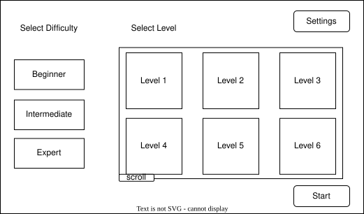
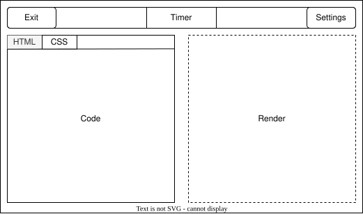
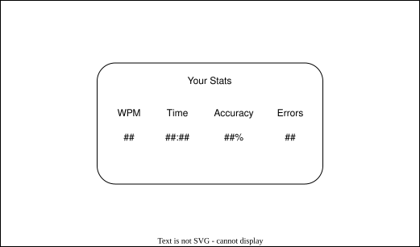

# Design Document

## Project Name

The game's working title is **Codekata**. This is a temporary name used across the UI (e.g., the landing-screen title) and docs until the team settles on a final one.

## Design Goals

Before deciding on any features, the team aligned on three primary goals that drive all design decisions:

1. **Learning through repetition:** the game should build genuine muscle memory for HTML and CSS syntax, not just test speed with arbitrary text
2. **Immediate visual feedback:** seeing your code render live makes the connection between syntax and result tangible and satisfying
3. **Building as the core mechanic:** completing a prompt means you have constructed a working mini webpage. The experience should feel like drawing or assembling something, not like a test. The rendered output is the reward, not just the score.

Features are evaluated against these goals. A feature that does not serve one of them is low priority regardless of how fun it sounds.

---

## User Personas

### Persona 1: The CS Student (primary)
- **Profile:** Undergraduate CS student, knows basic HTML/CSS conceptually, wants to improve syntax recall and typing speed
- **Goal:** Practice writing HTML tags and CSS properties faster, with immediate feedback on whether the output looks right
- **Pain point:** Existing typing games use prose text — there is no game that specifically reinforces code syntax
- **Scenario:** Has 10 minutes between classes, wants a quick practice session before an assignment

### Persona 2: The Hobbyist Developer
- **Profile:** Self-taught, learning HTML/CSS from tutorials, wants a more engaging way to practice than copy-pasting examples
- **Goal:** Build muscle memory for common patterns (flexbox, selectors, semantic HTML) through repetition
- **Pain point:** Passive learning (reading, watching videos) does not translate to fast, confident typing
- **Scenario:** Practicing in the evening after work, wants to track improvement over multiple sessions

### Persona 3: The TA / Grader (developer persona)
- **Profile:** Needs to clone, run, and evaluate the project quickly without a complex setup
- **Goal:** Open the app in a browser within 60 seconds of cloning the repo, understand the codebase structure, and verify features work
- **Pain point:** Undocumented or complex build processes waste grading time
- **Scenario:** Evaluating the project for the first time with no prior context

---

## User-Centered Design Flow

```
Landing Screen
  │
  ├── Select difficulty (Easy / Medium / Hard)
  ├── Select prompt (Level to build)
  │
  v
Game Screen
  ├── [Left pane]  - prompt display + input area
  ├── [Right pane] - live rendered result (iframe)
  ├── [Top bar]    - timer (counts up by default; counts down in challenge mode), reset button, back to landing button, light/dark mode toggle
  │
  ├── User types -> input compared character-by-character against prompt
  ├── Correct characters: advance cursor, update render pane
  ├── Incorrect characters: highlight error, increment error count
  │
  v
End Screen
  ├── Full rendered result displayed
  ├── Metrics summary: WPM, accuracy %, error count, time
  └── Options: Back to level select, Play Again (same prompt)
```

Wireframes:
  - 
  - 
  - 

---

## Visual Design Principles

### Layout
- **Split-pane (desktop):** input on the left, render on the right, roughly 50/50
- Clean separation between the code area (monospace, dark) and the rendered output (normal browser defaults)
- Metrics are shown on the End Screen only, not as a persistent in-game bar — the live render is the in-game feedback

### Mobile Layout
Mobile is a first-class layout target, not a stretch goal.

- **Portrait:** render pane on top, input pane on bottom — the user sees what they are building above their keyboard
- **Landscape:** side-by-side, same as desktop but condensed
- Prompts on mobile are scoped to short snippets (individual tags, single properties) to suit on-screen keyboard input (see [Mobile Snippets](#mobile-snippets))

_Exact breakpoints and layout switching: TBD during UI implementation._

*Driven by: "type small amounts of code on mobile"; "vertical or landscape modes"*

### Typography
- Code input and prompt display: monospace font (Fira Code or similar) for accurate character spacing
- UI text (labels, metrics, buttons): system sans-serif for readability

### Color and Theming
- **Default:** dark theme (reduces eye strain for extended sessions)
- **Toggle:** light theme available

*Driven by: "light and dark theme"*

- **Team brand colors** (yellow, purple, orange) used for interactive elements, highlights, and correct/error state indicators

### Correct / Error States
- Correct characters: subtle highlight (green tint, underline, or just brighter text)
- Incorrect characters: clear error highlight (red tint), do not auto-advance the cursor
- Current cursor position: blinking caret or underline

### Accessibility Targets
- WCAG AA minimum contrast ratio for all text
- Keyboard navigable (no mouse required to play)
- Font size adjustable via browser zoom or in-game setting
- Respect `prefers-color-scheme` media query for default theme selection

*Driven by: "adjust font size and contrast settings"*

---

## Countdown Challenge Mode

The default play mode uses a count-up timer that stops when the prompt is completed. **Countdown Challenge Mode** is an alternative where a countdown timer is set at the start and the round ends when it expires, regardless of completion progress.

_Exact design (timer duration, scoring, how it differs from free-play) TBD._

*Driven by: "separate countdown mode so that the game feels challenging and competitive"*

---

## Audio and Animations

Both are low-priority and deferred until core gameplay is stable. When implemented:

- **Sound effects** should reinforce correct/error states and prompt completion
- **Animations** (e.g., characters appearing as the render pane builds) should make the building mechanic feel more satisfying

*Driven by: "background music and sound effects"; "animations when making the website"*

---

## Difficulty Levels

The following are general ideas of what each difficulty should consist of

**Easy**
- Target Audience: Beginners and mobile users playing in short bursts
- Complexity (CSS): Simple styling changes and basic properties. Prompts focus on foundational CSS like basic coloring, text sizes, and text colors
- Complexity (HTML): Basic HTML elements such as single-line HTML tags (buttons, images, paragraphs, headers, lists)

**Medium**
- Target Audience: Intermediate learners who want to speed up and recognize structural patterns
- Complexity (CSS): Structural layouts and intermediate styling such as: container layouts (flexbox, grid, etc). Image sizes and gradients
- Complexity (HTML): Nested HTML structure such as nested divs, multiple divs, containers, input boxes

**Hard**
- Target Audience: Students or developers wanting to master dynamic CSS patterns
- Complexity (CSS): Hover animations, events, keyframes, transitions, and other advanced styling rules such as dynamic size for different devices (mobile, tablet, etc)
- Complexity (HTML): More detailed HTML structure (detailed forms, deeply nested components, multiple HTML files)


## Mobile Snippets

On mobile, typing long, symbol-heavy code (brackets, quotes, semicolons, indentation) on an on-screen keyboard is slow and frustrating. To keep mobile play comfortable, mobile prompts are reduced to **snippets**: on each line the player types only the single interesting token, and the surrounding scaffold auto-fills.

This section is the design/UX view of the snippet mechanic. The JSON schema and the inline `{{...}}` marker syntax that implement it are specified in [ADR-004: Prompt Schema](./decisions/004-json-prompt-schema.md). A single level file drives both desktop (type the full content) and mobile (type only the snippets) — authors do not maintain separate versions.

*Driven by: "As a mobile user, I want to type small amounts of code, such as tags, keywords, or short snippets, because typing symbols and long text is difficult on mobile."*

### What the mobile user types

A snippet is the *interesting* part of a line — the thing the level is teaching — never its punctuation. Tags, keywords, class names, property names, and property values are all valid snippets; brackets, quotes, semicolons, and indentation are always scaffold and are never typed on mobile.

| Line in the level | Mobile user types | Auto-filled scaffold |
|---|---|---|
| `<section>` | `section` | `<` … `>` |
| `<div class="card">` | `card` | `<div class="` … `">` |
| `display: flex;` | `flex` | `display: ` … `;` |
| `justify-content: center;` | `justify-content` | `: center;` |

### How it stays comfortable to type

- **Up to two snippets per line.** A line asks for at most two short tokens (for example a tag and its class, or a property and its value), never a long block. Lines that are pure structure (closing tags, braces, blank lines) carry no snippet and auto-advance.
- **Line-by-line flow.** Mobile players progress one line at a time, typing only that line's snippet. They are never confronted with a full multi-line block at once.
- **Scaffold auto-fills.** The brackets, quotes, and punctuation around the snippet are filled in for the player, so the hard-to-reach symbols on a mobile keyboard are never typed.

### Input area on small screens

- In portrait, the render pane sits above the input area so the user sees what they are building directly above the keyboard (see [Mobile Layout](#mobile-layout)).
- Because the player only ever enters one short token at a time, the mobile input can be a single short field rather than a multi-line code editor — easy to reach and read above an on-screen keyboard.
- Snippet entry should tolerate mobile keyboard behaviors (autocapitalization and autocorrect are disabled for the code field, since `section` and `Section` are not interchangeable).

### Prompt length and difficulty

Snippet length scales with difficulty rather than overwhelming mobile users at every level. This maps onto the tiers in [Difficulty Levels](#difficulty-levels):

- **Easy:** short single tokens (a tag name, a color, one property) — fully comfortable on mobile, the primary mobile target.
- **Medium:** still one snippet per line, but more lines per level and longer tokens (e.g. `justify-content`).
- **Hard:** longer or symbol-heavy content that cannot be reduced to comfortable snippets is reserved for higher difficulty and is primarily a desktop experience; such levels are deprioritized on mobile.

A level marked `mobile: true` is expected to have a snippet on each of its typed lines. A level that has no comfortable snippet decomposition should be left to desktop/Hard rather than forced onto mobile; per ADR-004 the loader warns when `mobile: true` but no snippets are present.

---

## Feature Priority Alignment

_TBD feature tiers (core vs. low priority) will be mapped here against user stories once sprint planning is underway. See the [user stories](../specs/user-stories/user-stories.md) for the current full list._
